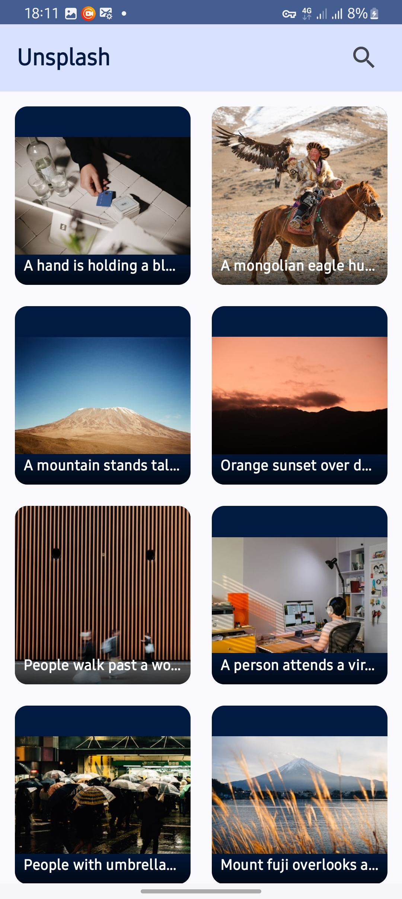
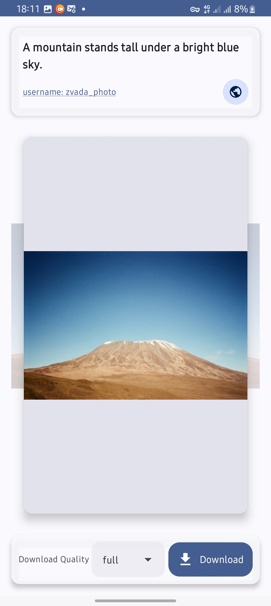
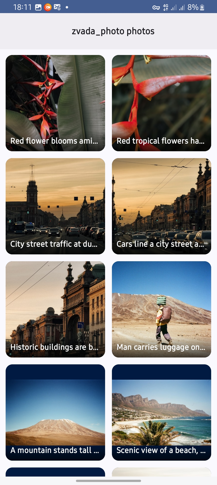
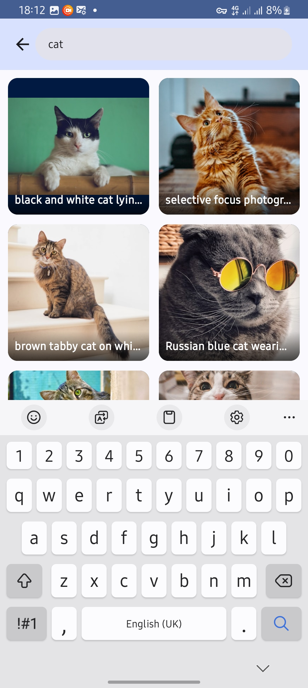
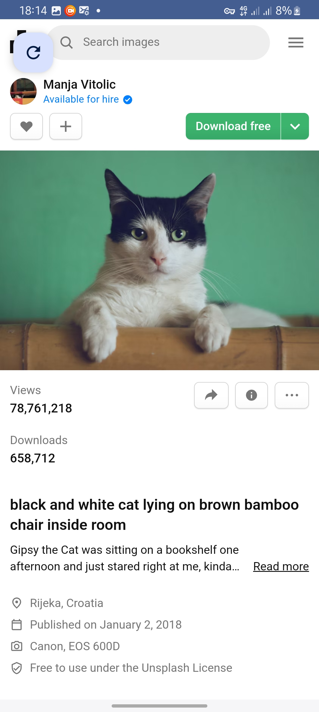

# Android Development with Jetpack Compose!

## Features

### Here are some of the project's best features:

* Search photo
* Download photo with the desired quality
* Beautiful Material 3 UI
* Smooth infinite scrolling
* High-quality image loading
* Dark/Light theme support

## Built with

### Technologies used in the project:


*   Clean Architecture
        Separation of concerns with three layers: Data, Domain, and Presentation
        Better testability and maintainability
*   MVI (Model-View-Intent)
        Unidirectional data flow
        Predictable state management
*   Retrofit/okhttp
        Type-safe HTTP client
        Efficient networking
*    Dagger-Hilt
        Dependency injection
        Easier testing and modularity
*    Material3
        Modern Android design
        Dynamic color support
*    Jetpack Compose
        Modern UI toolkit
        Declarative UI patterns
*    Pagination3
        Efficient data loading
        Smooth scrolling experience
*   Type safe Compose Navigation
        Safe navigation between screens
        Argument passing between destinations
*   Shared Element transition 
        From Screen to Screen passing elements 
        Making the UI transition seamless
*   Caching currently loaded images 
        Caching images with coil in order to decrease network bandwidth 
        Also lets the shared element transition possible


## 📱 Screenshots









### Installation Steps
1. Clone the repository
   ```bash
        git clone https://github.com/hailat1998/PhotoViewCompose.git
    ```
2. Open the project in Android Studio
3. Get your API key from [unsplash.com/developers](https://unsplash.com/developers)
4. Create ApiKey.kt file in the project and add:
 
```
const val API_KEY= "<YOUR API KEY>"
```

## License

This project is licensed under [MIT](LICENSE.md)  License.

## 🙏 Acknowledgments

* Unsplash API for providing the image service
* [Jetpack Compose Documentation](https://developer.android.com/compose) 


## Contribution
For contribution see [CONTRIBUTION](CONTRIBUTION.md)


### Thank you for checking out our project

